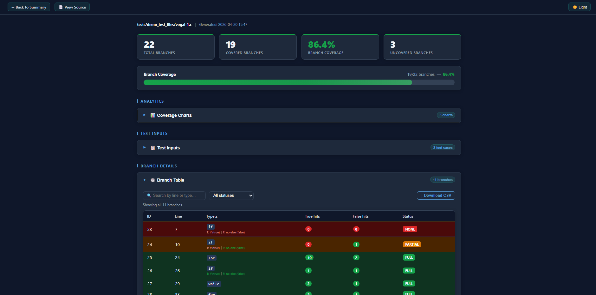
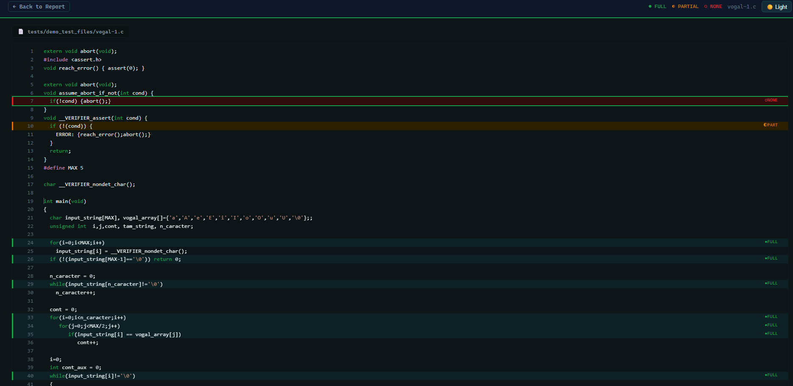
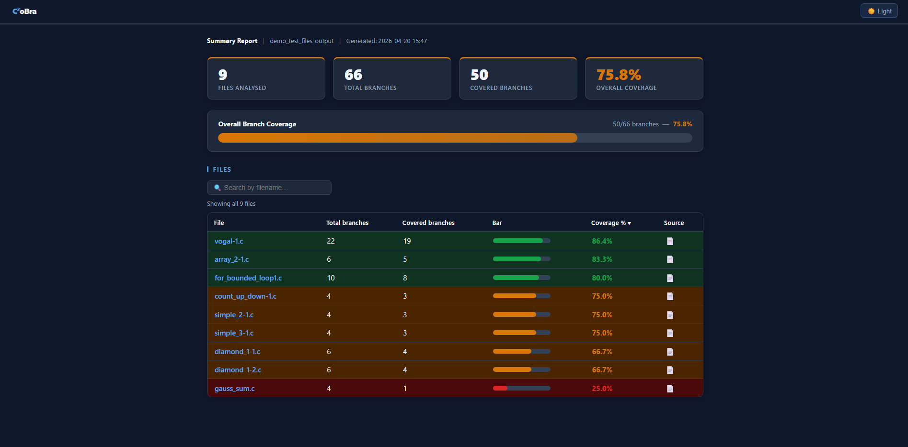

# C²oBra — C Coverage Branch Testing

[](https://glebtut.github.io/C_Testing_Coverage_Tool)
[](https://github.com/GlebTut/C_Testing_Coverage_Tool/actions)
[](LICENSE)
[](#screenshots)

<p align="center">
  
</p>

A source-level **branch coverage instrumentation tool** for C programs.
C²oBra automatically instruments C source files to track which branches are executed during testing,
then reports coverage results as interactive HTML/CSV reports with VS Code-style source view,
a summary dashboard, and full CI/CD integration via GitHub Actions.

---

## How It Works

1. **Instrument** — `src/instrument.py` parses a C source file using tree-sitter and injects `cov_branch()` calls around every branch (`if`, `while`, `for`, `do-while`, `switch`, ternary)
2. **Compile & Run** — the instrumented file is compiled with `src/cov_runtime.c` and executed against Sikraken-generated test inputs; each run is classified as `pass`, `partial`, `timeout`, or `crash`
3. **Report** — branch coverage is calculated per branch edge (true/false) and output as JSON + interactive HTML/CSV with annotated source view
4. **Summary** — `src/merge_reports.py` aggregates all per-file results into a single `summary_report.html` dashboard
5. **Deploy** — GitHub Actions automatically instruments, compiles, tests, and publishes reports to GitHub Pages on every push to `main`

---

## Requirements

- Python 3.10+
- GCC
- gcc-multilib (for 32-bit compilation support used by Sikraken)
- python3-venv
- tree-sitter, tree-sitter-c (see `requirements.txt`)

---

## Setup

### Option A — Quick install (recommended)

```bash
git clone https://github.com/GlebTut/C_Testing_Coverage_Tool.git
cd C_Testing_Coverage_Tool
chmod +x install.sh
bash install.sh
```

### Option B — Manual setup

#### 1. Install system dependencies

```bash
sudo apt install python3.12-venv gcc-multilib
```

#### 2. Clone and set up the project

```bash
git clone https://github.com/GlebTut/C_Testing_Coverage_Tool.git
cd C_Testing_Coverage_Tool
python3 -m venv venv
source venv/bin/activate
pip install -r requirements.txt
```

---

## Smoke Test

After installation, verify everything works end-to-end:

```bash
bash smoke_test.sh
```

Expected output:
```
✓ Found 4 branches (2 branch constructs)
Branch coverage: 100.0%
✅ Smoke test passed. Open smoke_report.html to view coverage.
```

---

## Usage

### Run the full pipeline on a single file

```bash
bash c2obra.sh filePATH/fileNAME
```

The pipeline runs these steps automatically:

1. **Auto-detects** if the file uses `__VERIFIER_nondet_*` inputs
2. **Step 0** *(input-driven files only)* — runs Sikraken with a 10s budget to generate a test suite XML
3. **Step 1** — instruments the C file via `src/instrument.py`
4. **Step 2** — compiles the instrumented file with `gcc` + `cov_runtime.c` + `verifier_stubs.c`
5. **Step 3** — runs all test cases via `src/run_tests.py` (parallel execution); classifies each run as `pass`, `partial`, `timeout`, or `crash`
6. **Step 4** — generates interactive HTML/CSV coverage report via `src/report.py`

**Example output:**
```
=== Detected: input-driven file ===
=== Step 0: Run Sikraken ===
✓ Sikraken done → ~/sikraken/sikraken_output/benchmark01_conjunctive/test-suite
=== Step 1: Instrument ===
=== Step 2: Compile ===
=== Step 3: Run Tests ===
=== Step 4: Report ===
✓ Wrote report to output/benchmark01_inst_report.html
```

> **Note:** Sikraken must be installed at `~/sikraken/` — see the Sikraken section below.

### Run the full pipeline on a directory

```bash
bash c2obra.sh path/to/directory/
```

Recursively instruments all `.c` files, assigns globally unique branch IDs across all files,
compiles and runs each benchmark, then generates a summary report at `output/summary_report.html`.

### Benchmark a file against a Sikraken test suite (timed)

```bash
bash benchmark_cobra.sh PATH/TO/FILE.c PATH/TO/test-suite
```

Runs the full pipeline with per-step timing and prints a structured results block:

```
========================================
 C²oBra Benchmark: Problem_16
 Suite:  /home/user/sikraken_output/Problem_16/test-suite
 Date:   Mon Apr 20 16:35:50 IST 2026
========================================
[1/4] Instrumenting...   ✅ Done in 4253ms — branches: 14472
[2/4] Compiling...       ✅ Done in 5317ms
[3/4] Running tests...   ✅ Done in 462ms (exit 0)
[4/4] Generating report...✅ Done in 8469ms

========================================
 RESULTS: Problem_16
========================================
 Coverage:      17.9%
 Branches:      2592 / 14472
----------------------------------------
 Instrument:    4253ms
 Compile:       5317ms
 Run tests:     462ms
 Report:        8469ms
 TOTAL:         18501ms
========================================
```

### Inspect a report locally (no server needed)

Open `covcheck.html` in your browser and drag-and-drop any `coverage_report.json` file to view:
- KPI cards (total branches, full/partial/none counts, test run count)
- Segmented coverage progress bar (green = fully covered, amber = partial, grey = not covered)
- Filterable branch table with status badges
- Test run list with inputs, status, and pass/fail/timeout/crash classification
- Multi-file comparison mode when multiple JSON files are loaded simultaneously

### Generate HTML/CSV report manually

```bash
source venv/bin/activate
python3 src/report.py output/benchmark_inst_branch_map.json output/benchmark_inst_coverage.json
```

This generates:
- `output/benchmark_inst_report.html` — interactive C²oBra coverage report (dark/light mode, sorting, filtering, run-status badges)
- `output/benchmark_inst_report.csv` — CSV export
- `output/benchmark_inst_source.html` — VS Code-style source view with branch highlighting

### Generate summary report across multiple benchmarks

```bash
source venv/bin/activate
python3 src/merge_reports.py output/
```

Generates `output/summary_report.html` — a dashboard with KPI cards, overall progress bar,
and a per-file table with coverage %, branch counts, and colour-coded status rows.

---

## Coverage Model

C²oBra uses an **edge-based branch coverage model** consistent with gcov:

```
coverage % = (true_branches_hit + false_branches_hit) / total_branches × 100
```

Each branch construct (`if`, `while`, `for`, `do-while`, `switch` case) produces
**2 branches**: one for the **true** path and one for the **false** path.

For example, a single `if` statement at line 10 = 2 branches:
- `if` at line 10 — true branch (condition holds)
- `if` at line 10 — false branch (condition does not hold)

### Run Status Classification

Each test run is classified based on exit condition and whether branch data was saved:

| Status    | Condition                                      |
|-----------|------------------------------------------------|
| `pass`    | Clean exit (code 0 or non-zero with branches)  |
| `partial` | Timeout or crash — but branch data was saved   |
| `timeout` | Timed out with no branch data saved            |
| `crash`   | Signal kill (SIGSEGV/SIGABRT/SIGFPE), no data  |

Partial coverage is always preserved — no data is lost regardless of how a run terminates.

---

## Project Structure

```
C_Testing_Coverage_Tool/
├── src/
│   ├── instrument.py       # Core instrumentation logic (tree-sitter AST)
│   ├── run_tests.py        # Parallel test runner with status classification
│   ├── report.py           # HTML/CSV/source-view report generator (C²oBra UI)
│   ├── merge_reports.py    # Summary dashboard across multiple benchmarks
│   ├── cov_runtime.c       # Runtime coverage tracking (signal handlers, dump)
│   ├── cov_runtime.h       # Runtime header (cov_branch() macro, MAX_BRANCHES)
│   └── verifier_stubs.c    # Stubs for SV-COMP verifier functions
├── tests/                  # C benchmark files (SV-COMP / custom)
│   ├── loop-simple/        # Loop-focused test cases
│   └── *.c                 # Conjunctive / linear / disjunctive benchmarks
├── output/                 # Instrumented files and reports (generated, not tracked)
├── build/                  # Compiled test binaries (generated, not tracked)
├── .github/
│   └── workflows/
│       └── coverage.yml    # GitHub Actions CI/CD pipeline (4-job workflow)
├── docs/
│   └── testing-notes/      # Manual testing logs
├── examples/
│   └── simple_if.c         # Minimal smoke-test example
├── c2obra.sh               # End-to-end pipeline script
├── benchmark_cobra.sh      # Timed benchmarking script
├── smoke_test.sh           # Post-install sanity check
├── covcheck.html           # Standalone drag-and-drop report viewer (no server needed)
├── install.sh              # One-command installer
└── requirements.txt
```

---

## Dependencies

| Package       | Version | Purpose                          |
|---------------|---------|----------------------------------|
| tree-sitter   | 0.25.2  | C source parsing and AST walking |
| tree-sitter-c | 0.24.1  | C grammar for tree-sitter        |

---

## Benchmark Results

### Iteration 3 — Full Scale Validation (538 programs)

| Tool        | Avg Coverage | Programs | Notes |
|-------------|--------------|----------|-------|
| **C²oBra**  | **62.7%**    | 538      | Syntactic AST, no reachability filter |
| TestCov     | 69.9%        | 538      | Post-compilation filtering (smaller denominator) |
| TestCoCa    | 48.0%        | 538      | Syntactic AST, no filter |

> TestCov's higher average is due to reachability filtering — it excludes unreachable branches from the denominator. C²oBra's denominator is more conservative (all syntactic branches).

### Iteration 3 — Problem_16 Benchmark

| Step        | Time          |
|-------------|---------------|
| Instrument  | 4,253 ms      |
| Compile     | 5,317 ms      |
| Run tests   | 462 ms        |
| Report      | 8,469 ms      |
| **Total**   | **18,501 ms** |

- **14,472** branches detected &nbsp;|&nbsp; **2,592** covered &nbsp;|&nbsp; **17.9%** coverage

### Iteration 3 — Tool Comparison (functions_test.c)

| Tool        | Branches   | Coverage % | Filtering Strategy          |
|-------------|------------|------------|-----------------------------|
| TestCov     | 7 / 18     | 38.89%     | Post-compilation filtering  |
| Sikraken    | 7 / 20     | 35.00%     | CFG-reachable from main     |
| TestCoCa    | 7 / 24     | 29.17%     | Syntactic AST, no filter    |
| **C²oBra**  | **7 / 24** | **29.17%** | Syntactic AST, no filter    |

C²oBra correctly covered all 4 truly reachable branches — **100% of coverable branches**.

### Iteration 2 — Scale Results (for reference)

| Benchmark Set            | C²oBra | TestCoCa | TestCov |
|--------------------------|--------|----------|---------|
| Custom benchmarks (12)   | 84.9%  | 79.8%    | 76.3%   |
| SV-COMP benchmarks (145) | 58.1%  | 50.4%    | 47.7%   |
| All benchmarks (157)     | 60.2%  | 53.3%    | 51.0%   |

---

## Screenshots

> Screenshots stored in [`docs/screenshots/`](docs/screenshots/)

### HTML Coverage Report


### Source View with Branch Highlighting


### Summary Dashboard


---

## CI/CD & GitHub Pages

Every push to `main` triggers a four-job GitHub Actions pipeline:

1. **install** — sets up Python venv, caches dependencies
2. **pipeline** — runs C²oBra on all test files in parallel (matrix strategy)
3. **verify** — merges artefacts, generates master `index.html` with aggregate KPIs
4. **deploy** — publishes all reports to GitHub Pages

📊 **Live reports:** [https://glebtut.github.io/C_Testing_Coverage_Tool](https://glebtut.github.io/C_Testing_Coverage_Tool)

---

## Sikraken (Required External Tool)

C²oBra uses **Sikraken** for symbolic execution and automatic test input generation.

- Download: [https://zenodo.org/records/18062402](https://zenodo.org/records/18062402)
- Extract the zip to `~/sikraken/` so the script is at `~/sikraken/bin/sikraken.sh`
- Make all Sikraken scripts and binaries executable:

```bash
chmod +x ~/sikraken/bin/sikraken.sh
chmod -R +x ~/sikraken/bin/
chmod -R +x ~/sikraken/eclipse/
```

> **Important:** The Sikraken zip archive often does not preserve execute permissions.
> Running `chmod -R +x` on both `bin/` and `eclipse/` avoids fixing permissions incrementally.

---

## Troubleshooting

### `python3 -m venv venv` fails with "ensurepip is not available"
```bash
sudo apt install python3.12-venv
```

### Sikraken fails with `Permission denied` on `.sh` or `eclipse` binaries
```bash
chmod -R +x ~/sikraken/bin/
chmod -R +x ~/sikraken/eclipse/
```

### Sikraken fails with `bits/wordsize.h: No such file or directory`
```bash
sudo apt install gcc-multilib
```

### Coverage report shows 0% on a benchmark that ran successfully
This usually means the binary was killed before coverage was flushed.
Use `bash c2obra.sh` (which sets resource limits and uses two-stage kill) rather than running the binary directly.

### Partial coverage instead of full coverage
Check the run status in the HTML report's Test Inputs table.
A `partial` badge means the run was killed (timeout/crash) but branch data was still saved.

---

## Academic Citation

> Tutubalin, G. (2026). *C²oBra: A Source-Level Branch Coverage Instrumentation Tool for C Programs*. SETU, Ireland.

---

*C²oBra — C Coverage Branch Testing*
